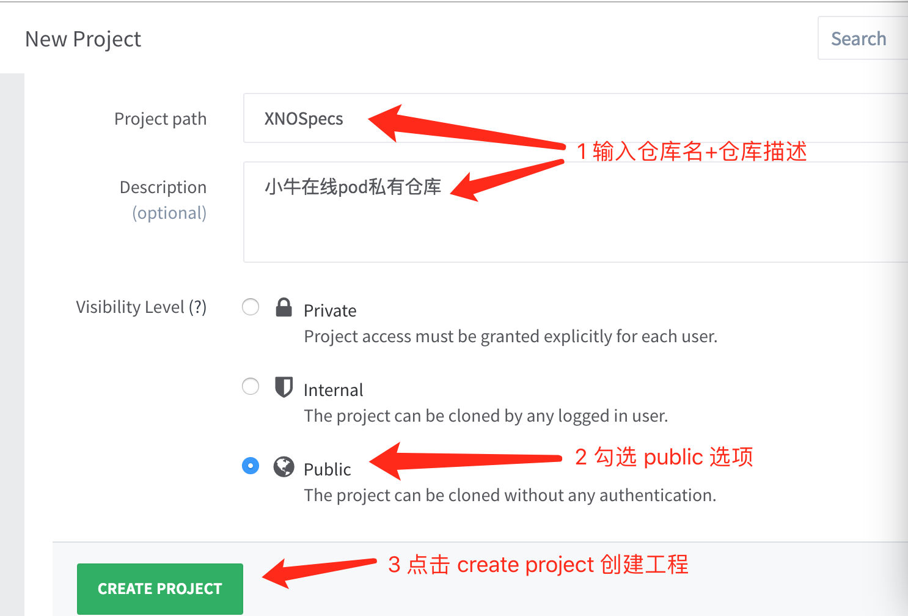
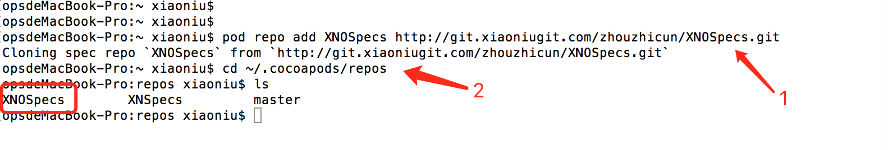
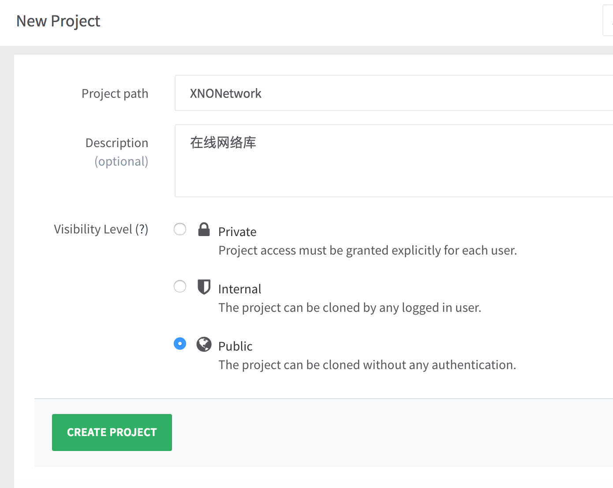
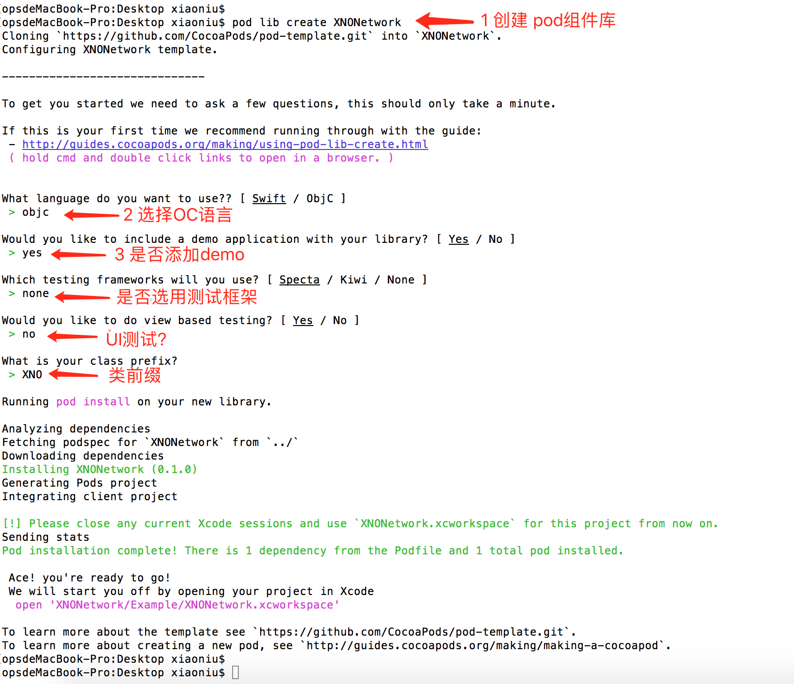
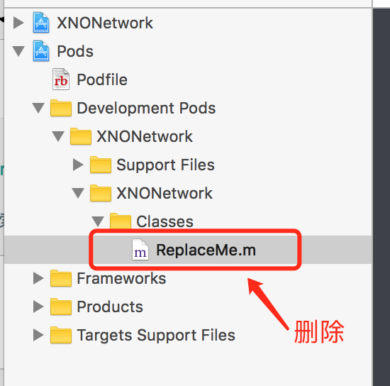
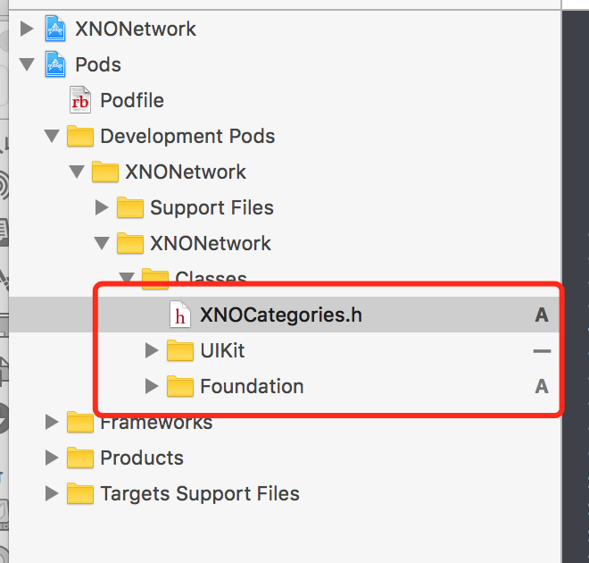
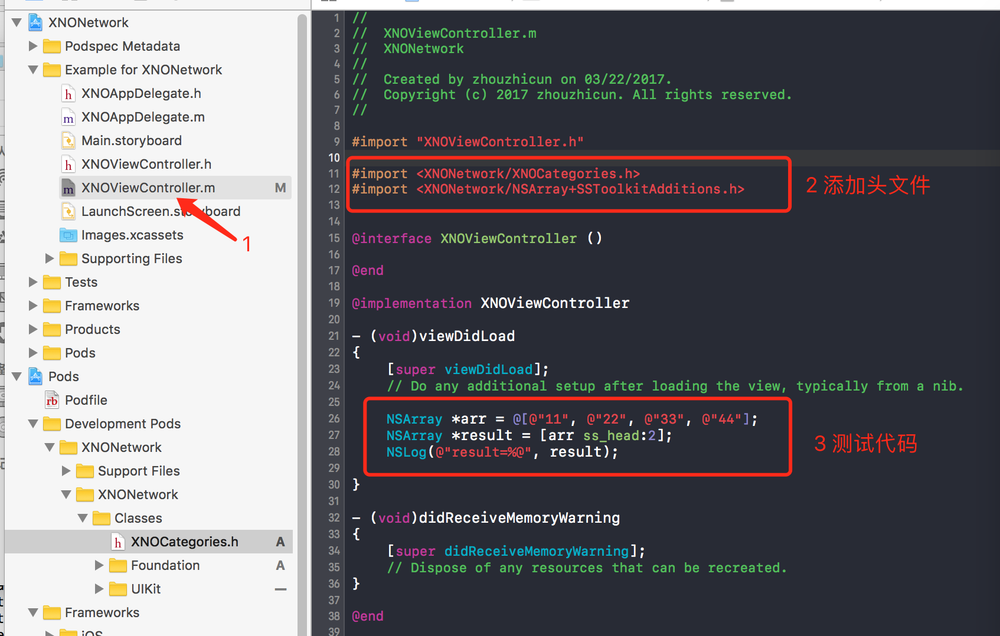
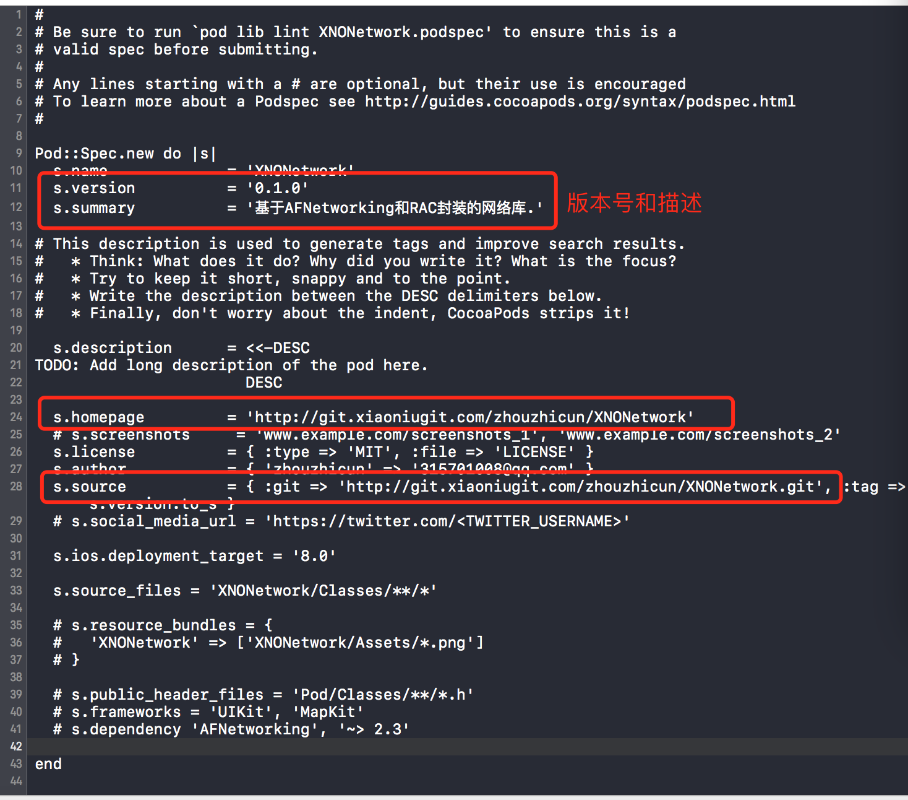
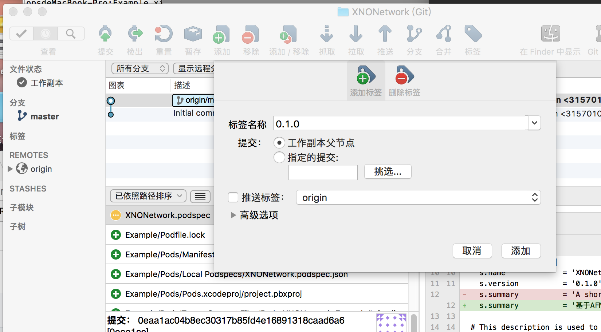

# pod私有库


参考文档: [pod远程私有仓库创建](http://www.jianshu.com/p/7cc943ec8a18)

## 一、创建spec repo

#### 1 创建远端Specs仓库。

##### 打开gitlab, 创建一个空仓库即可。如图所示:



#### 2 将远端的私有Specs仓库clone到本地.cocoapods目录，命令如下:

	pod repo add XNOSpecs http://git.xiaoniugit.com/zhouzhicun/XNOSpecs.git

##### 命令执行完成后, 打开cocoapods/repos/下查看是否存在的pod私有库的索引目录，如图所示：




## 二、创建私有pod库

#### 1 创建pod组件的git仓库

##### 打开gitlab, 创建一个空的pod组件仓库即可。如图所示:



#### 2 创建pod组件

如何创建一个pod库
参考文档：https://www.jianshu.com/p/4685af9dd219

创建一个Pod库： pod lib create  XXX
通过pod lib create创建一个pod,分析创建流程
当执行pod lib create ProjectName时,其实是下载了一个pod模板,然后在内部通过更改.podspec文件的配置定制化自己的pod,
pod lib create ProjectName其实使用了默认参数, 补全的话pod lib create ProjectName --template-url=https://github.com/CocoaPods/pod-template.git,

注意: 
基于自定义pods的实现细节,在向Pod/Classes或者Pod/Assets文件增加类或者更新podspec文件时,需要运行pod install或者pod update。


##### 打开终端，输入如下命令(其中XNONetwork为组件名):

	pod lib create XNONetwork 

如图所示:



#### 3 打开Example目录下的 XNONetwork.xcworkspace工程，展开pods子工程，将XNONetwork-->Classes-->ReplaceMe.m文件删除，



#### 然后添加组件相关的代码文件:



#### 编译运行OK。


#### 4 demo开发

##### 首先cd到Example目录，执行如下目录安装pod依赖:

```shell
pod install
```


##### 然后打开工程的代码文件，import需要的头文件即可,例如:



#### 编译运行OK。

#### 5 修改XNONetwork.podspec pod描述文件

如图所示:主要修改的地方已经用红框圈起来，其中:        
s.version: 组件版本号，每次迭代都需要修改，该版本号对应后续提交到git仓库的tag标签号.     
s.summary:组件库简单描述       
s.homepage:组件库首页        
s.source: 组件库git地址,即我们将要提交到gitlab的git地址。        

至于s.source\_files, s.public\_header\_files, s.frameworks, s.dependency依项目而定, 具体可以参考git上开源的pod库的.podspec文件。



#### 6 提交pod组件到git

方法1: 使用git命令操作,第一次提交使用git命令操作，后续迭代更新直接使用sourcetree即可。

	//0 cd到组件根目录
	cd ~/Desktop/XNONetwork
	
	//1
	git remote add origin http://git.xiaoniugit.com/zhouzhicun/XNONetwork.git
	
	//2
	git add .
	
	//3
	git commit -m "初始化组件库"
	
	//4
	git push origin master

方法2: 直接使用sourcetree
1. 先把第一步创建的空仓库clone到本地某个目录，然后删除.gitignore文件, 仅留下 . .. .git这三个;   
2. cd到组件根目录，并删除.git文件。
3. 把组件根目录下所有文件(包括隐藏文件)都拷贝到clone下来的本地文件夹中，然后提交即可。


#### 7 本地验证podspec文件, cd到组件根目录，然后执行	

	pod lib lint

#### 8 给组件打一个标签0.1.0, 并推送到远端。如图所示:



##### 输入tag(0.1.0),然后点击添加即可。再点击"推送"把刚创建的tag推送到远端。

 

#### 9 向私有的Spec repo中提交podspec:

	pod repo push XNOSpecs XNONetwork.podspec 

#### 10 验证pod组件是否可用：

	pod search XNONetwork

如果前面步骤都OK， 但是pod不出来的话，我们先到cocoapods/repos/XNOSpecs目录下看是否存在 XNONetwork，如果存在，说明pod的index文件有问题，删除pod index文件，再重新seach重建pod index文件。命令如下:

	//删除pod index文件
	rm ~/Library/Caches/CocoaPods/search_index.json
	
	//重新pod seach
	pod search XNONetwork(不区分大小写)
	
	输出：Creating search index for spec repo 'master'.. Done!，
	稍等片刻, 就会出现所有带有XNONetwork字段的类库。


​	

## 三、pod 组件的使用

#### 注意:platform ios的版本号不能低于pod组件依赖的版本号。

	source 'https://github.com/CocoaPods/Specs.git'
	source 'http://git.xiaoniugit.com/zhouzhicun/XNSpecs.git'
	
	target 'testApp' do
	platform :ios, '9.0'
	pod 'XNONetwork'
	end


