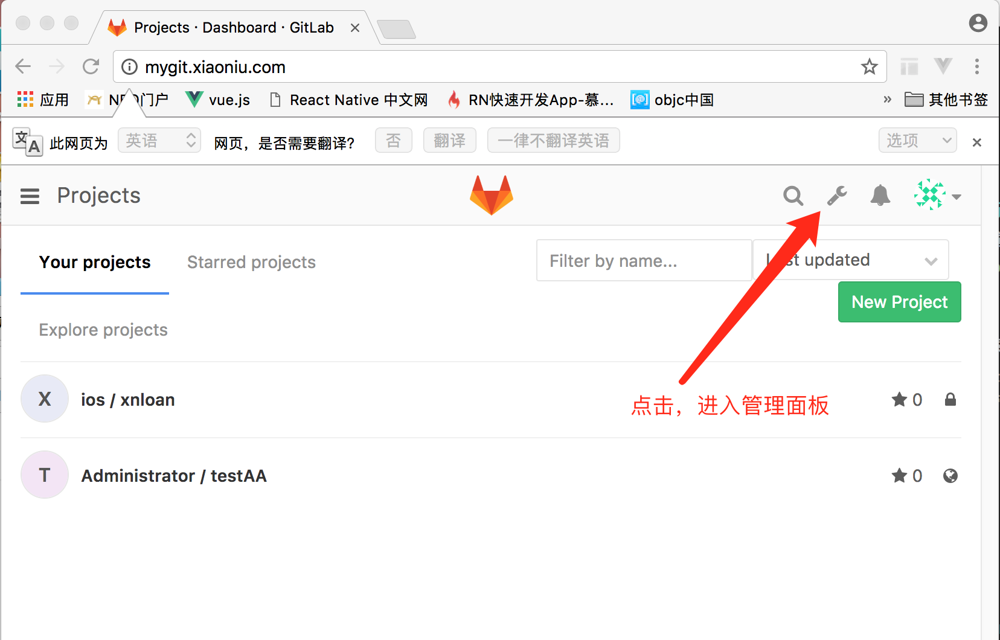
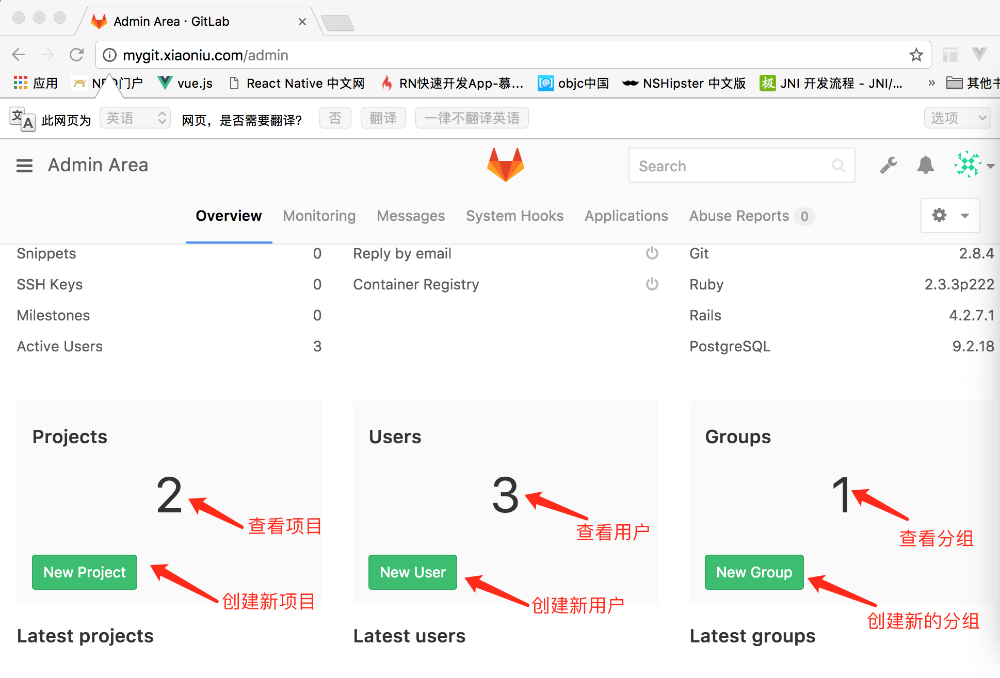
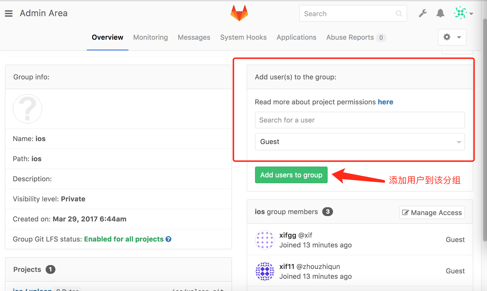
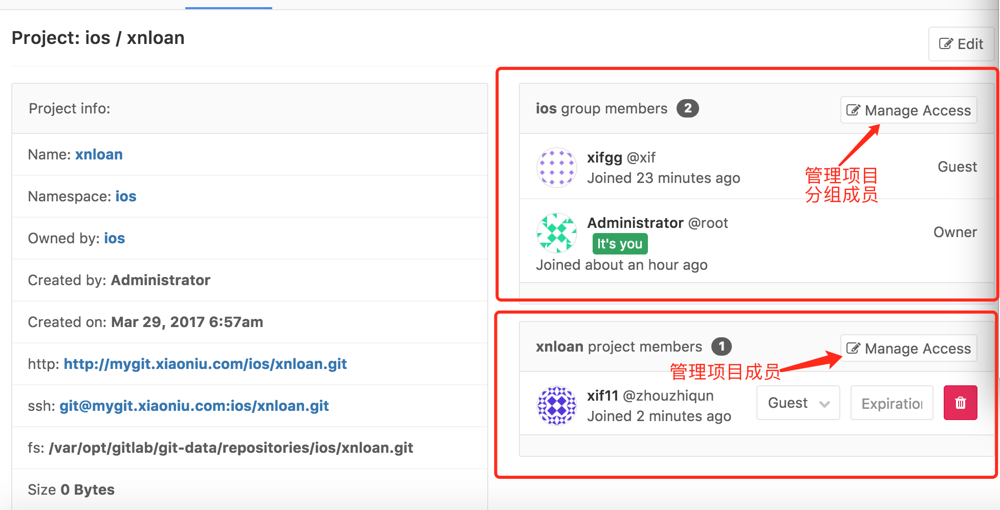

##gitLab环境搭建

###1. 虚拟机安装ubuntu
Parallels + Ubuntu linux 16.04      
安装完成后，建议把虚拟机配置改成 4核+4GB内存，不然配置太低的话后面搭建好的gitlab访问会非常缓慢。

#####虚拟机安装ubuntu成功后，接下来修改ubuntu software源:   
打开ubuntu software--->点击菜单 ubuntu software ---> software & update --> 选择第一个tab (ubuntu software)  ---> 修改download from ： 改成ustc源([http://mirrors.ustc.edu.cn/ubuntu](http://mirrors.ustc.edu.cn/ubuntu)). 然后close, 再reload即可。

###2. 安装gitLab
参考文档:     
[下载安装GitLab-CE](https://www.gitlab.cc/downloads/#ubuntu1604)
如果chrome浏览器打不开的话，请使用safari浏览器打开.

#####2.1 安装配置依赖项

如想使用Postfix来发送邮件,在安装期间请选择'Internet Site'. 您也可以用sendmai或者 配置SMTP服务 并 使用SMTP发送邮件.

在 Centos 6 和 7 系统上, 下面的命令将在系统防火墙里面开放HTTP和SSH端口.

	sudo apt-get install curl openssh-server ca-certificates postfix

#####2.2 添加GitLab仓库,并安装到服务器上

	curl -sS http://packages.gitlab.cc/install/gitlab-ce/script.deb.sh | sudo bash
	sudo apt-get install gitlab-ce
	
如果你不习惯使用命令管道的安装方式, 你可以在这里下载 [安装脚本](http://packages.gitlab.cc/install/gitlab-ce/) 或者 [手动下载您使用的系统相应的安装包(RPM/Deb)](https://mirrors.tuna.tsinghua.edu.cn/gitlab-ce/) 然后安装， 建议直接从上面的链接下载deb安装包。

	curl -LJO https://mirrors.tuna.tsinghua.edu.cn/gitlab-ce/ubuntu/pool/xenial/main/g/gitlab-ce/gitlab-ce-XXX.deb
	dpkg -i gitlab-ce-XXX.deb
	
#####2.3 启动GitLab

	sudo gitlab-ctl reconfigure

###3 修改gitlab配置
参考文档:    
[在自己的服务器上部署 GitLab 社区版](http://www.cnblogs.com/restran/p/4063880.html)

	sudo mkdir -p /etc/gitlab
	
	sudo touch /etc/gitlab/gitlab.rb
	
	sudo chmod 600 /etc/gitlab/gitlab.rb
	
	//修改gitlab.rb文件中的配置
	sudo gedit /etc/gitlab/gitlab.rb

修改gitlab.rb中的 external_url 为 "http://mygit.xiaoniu.com"
然后在客户机中添加 hosts配置:
	
1. 打开hosts文件
	
		sudo vim /etc/hosts
	
2. 添加host(172.20.16.108 mygit.xiaoniu.com）
其中172.20.16.108 就是虚拟机的ip地址, mygit.xiaoniu.com就是我们上面再gitlab.rb文件中指定的external_url。
	
		172.20.21.1    tech.xiaoniu88.net
		192.168.1.109  git.xnl
		172.20.31.101  git.xiaoniugit.com
		172.20.16.108  mygit.xiaoniu.com

		# Current Version 70
		# = prev + d(Wikipedia)
		# Newest Version http://go.netsh.org/link/gethosts
		::1   localhost
		fe80::1%lo0    localhost
		255.255.255.255    broadcasthost
		127.0.0.1    localhost
		# 17.151.36.30   gs.apple.com

	

###4 使用浏览器访问GitLab
打开客户机的浏览器，输出上面配置的external_url(即[http://mygit.xiaoniu.com](http://mygit.xiaoniu.com))即可。

####注意:
1. 首次访问GitLab,系统会让你重新设置管理员的密码,设置成功后会返回登录界面.
2. 默认的管理员账号是root。		
3. 如果你想更改默认管理员账号,请输入上面设置的新密码登录系统后修改帐号名.

##项目权限管理

参考文档: [Gitlab Group，Project 以及 角色间的对应关系](http://comedsh.iteye.com/blog/2238338)

###管理项目,用户,分组
#####第一步

#####第二步

###添加用户到指定分组
####首先进入该分组的管理页，然后参考下面操作:

###添加用户到指定项目
####首先进入该项目的管理页，然后参考下面操作:

